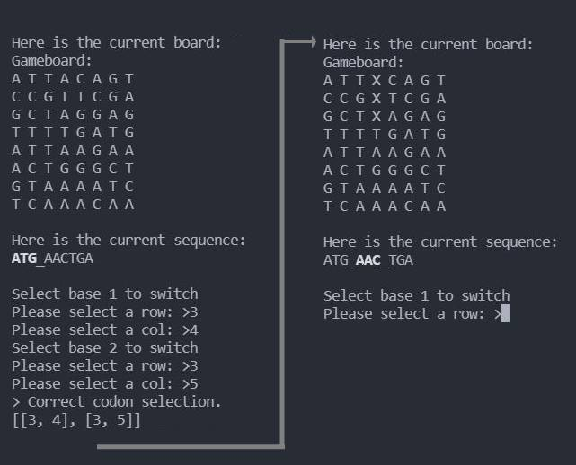

## GitHub projects for Aren Boulet

I am a passionate learner with an M.Sc. in Biochemistry, and over extensive experience in academic and industry research facilities. 

I became proficient with Python using online courses, and started using programming as way to analyze large datasets. As I learnt more Python, I found a new love from programming. It reminded me of building with LEGO where each block is a piece of code. The goal being to build something complex that works together.

 I have built my own small projects, and websites. I have taken University level courses in my spare-time, including bioinformatics, data structures, and machine learning (2022). 

I now code in Python, Linux, Java, HTML, CSS, and Javascript and hope to add more to this list in the future. Below are some of my interesting projects

### RNA-seq data pipeline for Next-Generation Sequencing Facility
Currently constructing a RNA-seq pipeline to process raw sequencing data on HPC cluster (slurm), and return enrichment results of specific genes based on sample treatment. The pipeline is controlled by a Python script that calls Shell scripts onto HPC nodes to process data using fastp, multiqc, STAR, htseq, and deseq2 (R programming language). 

[Branch containing RNA-seq pipeline](https://github.com/ngsf-usask/dex/tree/pipe_generation)

### Primer design for site-directed mutagenesis of any gene
Website coded using Python (Dash, Pandas, Plotly, Biopython). Recursively calculates all primers that match design guidelines for modification of nucleotides in a provided gene.
[Interactive primer design](https://acbfolio.herokuapp.com/app3)

In the future I plan to add ability to recognize gene IDs and directly import, as well as user control over design guidelines.

### Match-3 command line game to synthesize a gene
I built a simple game where the goal was to switch nucleotides (A, T, C, G) within a gameboard to try and match for provided codon. The goal of the game would be to complete the entire nucleotide sequence. It is a fun challenge in OOP programming, path-finding algorithms, and interactivity. 

In the future I plan to add a GUI interface, give users the option to provide genes, and track a leaderboard.

### Advent calendar challenges
As I am learning to code, I am always looking for new challenges. [Advent of Code](adventofcode.com) provides daily challenges in December (and remains posted afterwards) for people to solve. They also have a supportive community to help provide feedback and show the best answers for any giving problem. This is an incredible resource to practice  my skills, especially when learning a new language.

[Python-2019](https://github.com/acboulet/Advent_2019) -- [Python-2020](https://github.com/acboulet/advent2020_py) -- [Java-2020](https://github.com/acboulet/advent2020_java)

### Additional information about me if you made it this far

From an early age, I've always loved solving puzzles. Science became the perfect outlet for that curiousity. I've since worked on developing clinical diagnostic tests, mapping protein-protein interaction changes in metabolic diseases, and characterizing mouse models of human genetic diseases. This work has led to international recognition and publications. 

I am currently responsible the designing and carrying-out a wide range of sequencing projects. This includes advising on the overall approach, carrying out the bench-work, and running/maintaining the sequencing equipment itself.
